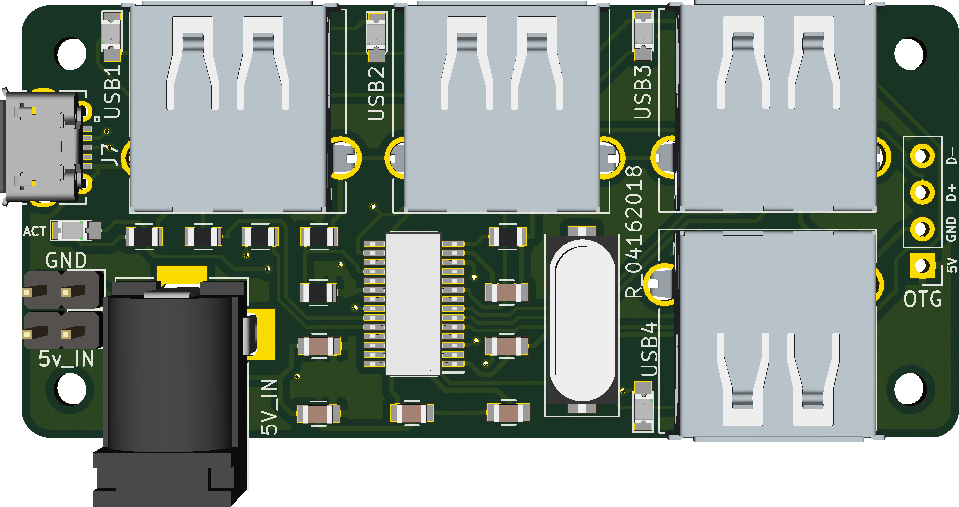
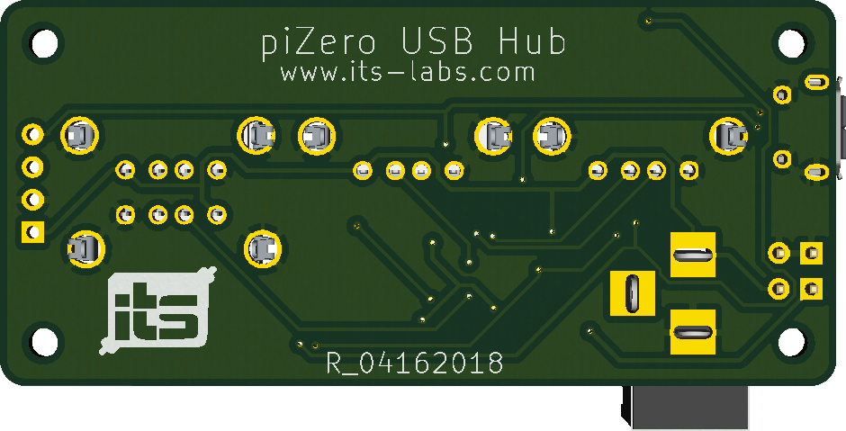

### Description

A small 4 port USB hub for the Raspberry Pi Zero

### License

 

This project is licensed under the Attribution-NonCommercial-ShareAlike CC BY-NC-SA 4.0 license. The full legal text of the license may be found in the LICENSE.txt file in this repository. For more information about this license, please visit 
the Creative Commons Foundation (https://creativecommons.org/licenses/by-nc-sa/4.0/).

Designed by Eladio Martinez

### Features

- 4 x USB 2.0 ports
- Micro USB upstream connector
- FE1.1s USB hub chip
- Solder pins for direct connection to the Raspberry Pi Zero
- Power jack connector for external 5v power source
- Optional jumpers to take power from upstream connector
- LED status indicators for each downstream port

Top Side

Bottom Side

### Modes of use

#### 1. Direct solder

You can solder 4 wires directly between the Zero and the hub using 4 pads exposed on both the hub and the Zero. This will connect the 5V, GND, USB D+ and USB D-.

You can then either power the board either using the USB power connector on the Zero, or using the power jack on the hub.

This is the neatest option, although does involve soldering.

#### 2. USB connection

Using a USB OTG cable, or a micro USB to micro USB you can connect the data USB port on the Zero to the upstream USB connector on the side of the hub. Adding the 2 power jumpers allows the hub to use power supplied to the Zero though the power USB connector.

Alternatively, remove the power jumpers and power the hub through the external power jack.

Although a USB cable is needed to connect the two in this mode, no soldering is required.

#### 3. Standalone hub

This board can be used as a regular USB hub, either using power from the upstream USB connector, or through the power jack and external power supply.
